## Overview

The Tonnetz — Euler's 1739 interval lattice, rediscovered by neo-Riemannian theorists — is not merely a picture of chord relationships. It is a **simplicial complex triangulating a torus**, and every chord progression on it is a cochain that decomposes, uniquely and orthogonally, into three mathematically distinct components.

This episode applies **discrete Hodge theory** (Eckmann 1944; Lim 2020) to the Tonnetz. The central result:

> *Any 1-cochain on the Tonnetz torus decomposes as:*
> \omega = \omega_{\text{exact}} \;+\; \omega_{\text{coexact}} \;+\; \omega_{\text{harmonic}}
> *where the three summands are pairwise orthogonal and uniquely determined.*

The three components correspond — as testable hypotheses — to functional cadences, chromatic PLR cycles, and remote modulations along the torus topology.

---

## Prerequisites

- Chord Space as Torus (EP01) — Tonnetz and PLR transformations
- Wave equation and Fourier series (EP02) — analogy with heat diffusion on manifolds
- All-Interval Rows and ℤ₁₂ (EP04) — cyclic group structure underlying pitch classes

---

## Preamble: What Is a "Hole"? Building Homology from Scratch

*Who this is for*: You have watched the video and understand the setup (boundary matrices, chain groups, Betti numbers), but the definition H_k = \ker(\partial_k)/\operatorname{im}(\partial_{k+1}) feels like a formula dropped from the sky. This preamble builds it from a single question: *what actually is a hole?*

### P.1 — The Naive Question

A doughnut has one hole. A pretzel has two. A solid ball has none.

First attempt: *"a hole is a region with nothing in it."* That doesn't work — the inside of a sphere is also "nothing," but a sphere doesn't have the same kind of hole as a torus.

Second attempt: *"a hole is something you can stick a finger through."* That's dimension-specific and requires 3D embedding.

The algebraic topology approach sidesteps all of this. Instead of defining what a hole *is*, we define what a hole *does*: **it obstructs you from filling in a closed curve.**

### P.2 — The Loop Test

Draw a closed loop on a surface. Try to "fill it in" — can you find a 2-dimensional patch whose boundary is exactly that loop?

On the **sphere**: every closed loop bounds a disk — no obstruction.

On the **torus**: the loop going *through* the hole cannot bound any patch. The hole *is* that obstruction.

**The algebraic challenge**: detect this without geometry or deformation. The answer is the boundary operator \partial.

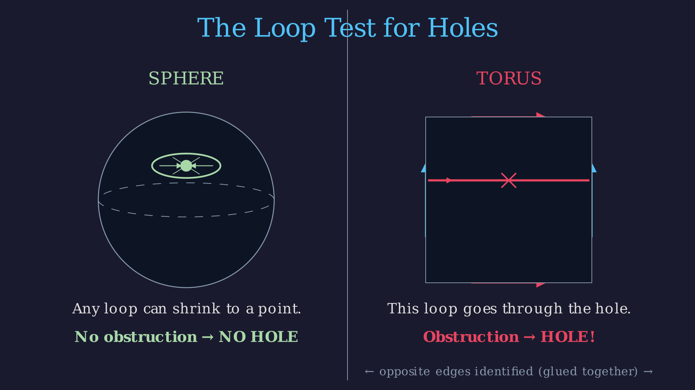

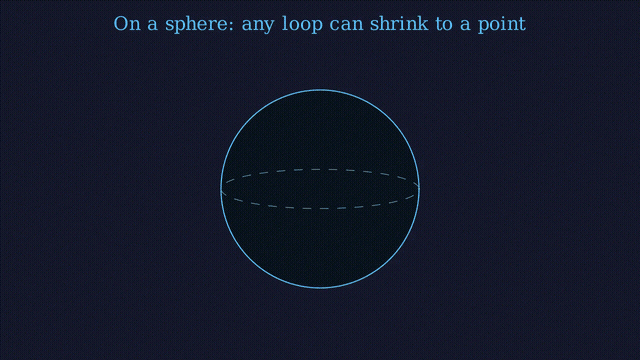

### P.3 — Chains: The Algebraic Skeleton

Replace the geometric surface with an oriented combinatorial skeleton. Work with **formal linear combinations** over \mathbb{R}:

- A **0-chain**: 3A - 2B + C — weighted vertices.
- A **1-chain**: [A,B] + 2[B,C] - [A,C] — weighted oriented edges.
- A **2-chain**: [A,B,C] - [D,E,F] — weighted oriented triangles.

Orientation: [B,A] = -[A,B]. These form real vector spaces C_0, C_1, C_2, \ldots

### P.4 — The Boundary Operator ∂

\partial_k takes a k-chain and returns its (k-1)-dimensional boundary:

\partial_0(A) = 0, \qquad \partial_1([A,B]) = B - A

\partial_2([A,B,C]) = [B,C] - [A,C] + [A,B]

Sign rule: delete each vertex in turn, alternating signs — the result is the counterclockwise perimeter.

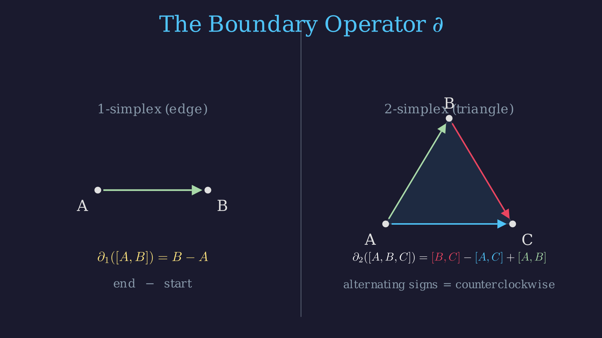

### P.5 — ∂² = 0: The Fundamental Identity


For any simplicial complex, \partial_k \circ \partial_{k+1} = 0.



Compute \partial_1(\partial_2([A,B,C])):
\partial_1\bigl([B,C] - [A,C] + [A,B]\bigr) = (C-B) - (C-A) + (B-A) = 0 \;\checkmark

In general, applying \partial_{k-1} to \partial_k[v_0,\ldots,v_k] = \sum_i (-1)^i [v_0,\ldots,\hat{v}_i,\ldots,v_k] and collecting terms by pairs (i,j) with i < j shows every pair cancels with opposite sign. \square


*Geometric meaning*: The boundary of a solid region is a closed surface — which has no boundary itself. Algebraic signs enforce this cancellation. **This one identity is what makes all of homology work.**

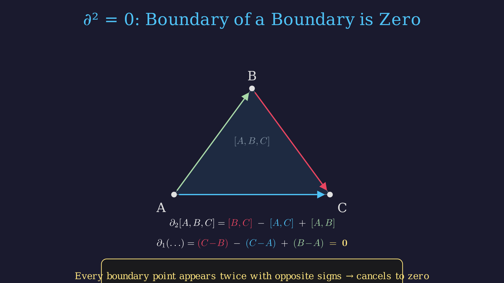

### P.6 — Cycles, Boundaries, and the Definition of a Hole


A **k-cycle** is a k-chain with zero boundary: Z_k = \ker(\partial_k).

A **k-boundary** is a k-chain in \operatorname{im}(\partial_{k+1}).

Since \partial^2 = 0: every boundary is automatically a cycle:
B_k \;\subseteq\; Z_k \;\subseteq\; C_k


| Chain | Cycle? | Boundary? |
|-------|--------|-----------|
| Open path [A,B] | No | — |
| Triangle perimeter \partial_2[A,B,C] | Yes | Yes |
| Loop through torus hole | Yes | **No** |

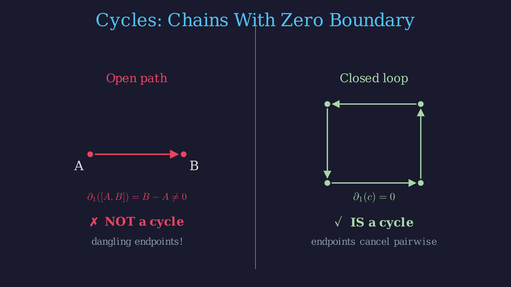

> **A k-dimensional hole is a k-cycle that is NOT the boundary of any (k+1)-chain.**

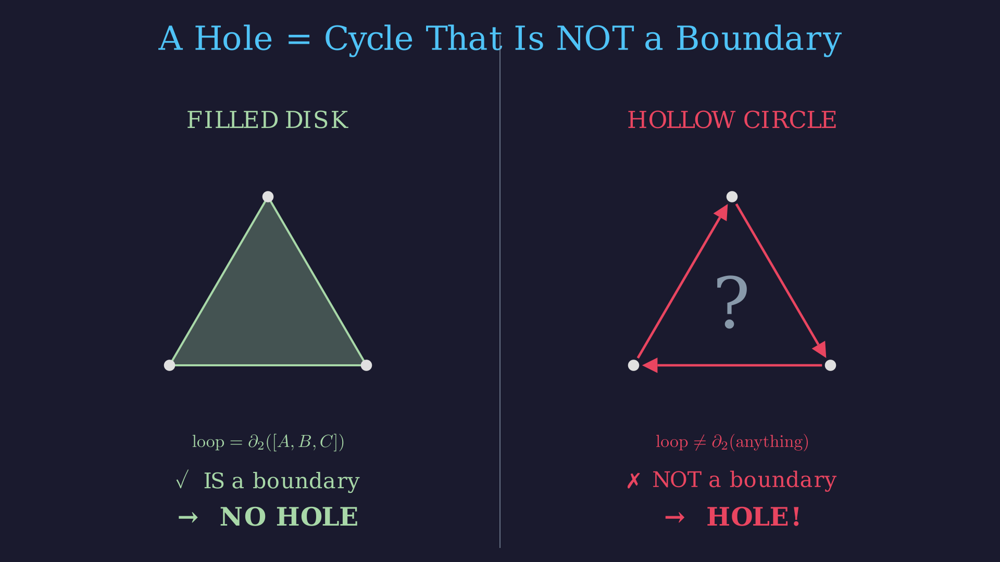

Two cycles are **homologous** if they differ by a boundary: c_1 \sim c_2 \iff c_1 - c_2 \in B_k.

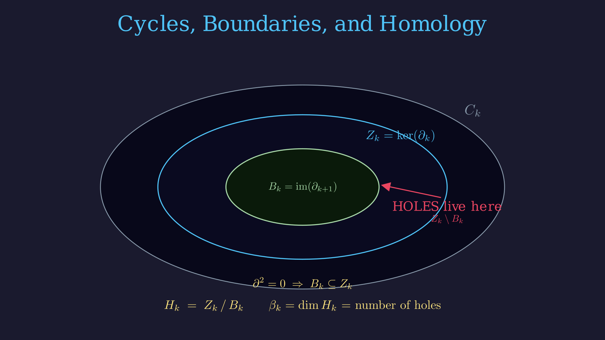


H_k = Z_k / B_k = \ker(\partial_k) \,/\, \operatorname{im}(\partial_{k+1})

The **k-th Betti number** \beta_k = \dim(H_k) counts independent k-dimensional holes.


### P.7 — Connecting to the Tonnetz Numbers

The video computes \dim(\ker \partial_1) = 25 and \operatorname{rank}(\partial_2) = 23. Therefore:
\beta_1 = 25 - 23 = 2

Of 25 closed loops, 23 can be filled by triangles (fake holes). The remaining **2 equivalence classes** are genuine: one along the circle of fifths, one along the major third cycle. These two holes are why the harmonic component of the Hodge decomposition is non-trivial.

*Water-flow analogy*: Boundaries B_k are currents driven by a potential — remove the pump and they stop. Non-boundary cycles are currents with no source, no sink, no pump — they persist because the topology allows it. H_k = Z_k/B_k is the space of "eternal currents."

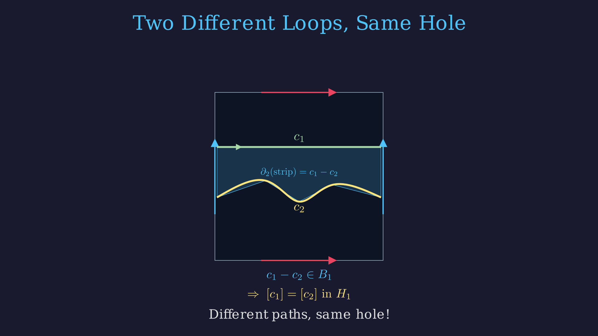

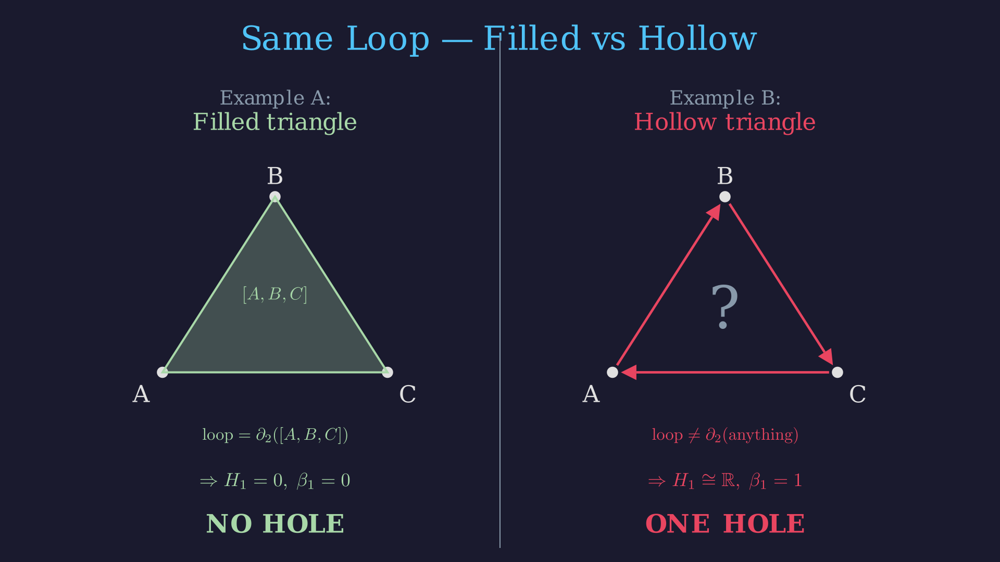

---

## The Tonnetz as a Simplicial Complex


The **Tonnetz** is a simplicial complex K triangulating the torus T^2 = S^1 \times S^1:

| Dimension | Cells | Count | Musical meaning |
|-----------|-------|-------|-----------------|
| 0 (vertices) | Pitch classes \{C, C\sharp, \ldots, B\} | 12 | Individual notes |
| 1 (edges) | Minor 3rd + Major 3rd + Perfect 5th | 36 | Consonant intervals |
| 2 (faces) | Major triads + Minor triads | 24 | Triads |

Euler characteristic: \chi(K) = 12 - 36 + 24 = 0. Since \chi = 2 - 2g for orientable closed surfaces, g = 1 — confirming the torus.



*中文:* "Tonnetz 的顶点是十二个音高类，边是音程，三角形是三和弦。整个结构是一个三角剖分的环面。"

The 36 edges are exactly the consonant intervals of Western voice leading: perfect fifths (3:2), major thirds (5:4), minor thirds (6:5). Going up 12 perfect fifths returns to the starting pitch class mod 12; going up 4 major thirds does the same (4 \times 3 = 12 semitones). Both directions "close up," forcing the torus topology.


**Betti numbers** (from \operatorname{rank}(\partial_1) = 11, \operatorname{rank}(\partial_2) = 23):

| \beta_k | Value | Meaning |
|-----------|-------|---------|
| \beta_0 = 12 - 11 | 1 | Connected: all pitch classes in one piece |
| \beta_1 = 25 - 23 | 2 | Two non-contractible loops: circle of fifths + major third cycle |
| \beta_2 = 24 - 23 | 1 | One enclosed cavity (the torus encloses a void) |

> *中文:* "Betti 数 1, 2, 1 是环面 T^2 的拓扑签名。"

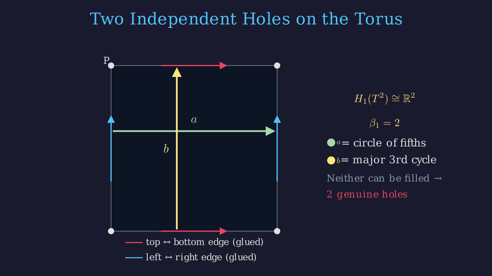

**The dual complex K^* (chicken-wire torus)**: Reversing the roles of vertices and faces — each triangle of K becomes a vertex, each shared edge becomes an edge, each vertex becomes a hexagonal face — gives the **Poincaré dual** K^*:

| In K | In K^* |
|--------|---------|
| 12 vertices (pitch classes) | 12 hexagonal faces |
| 36 edges (intervals) | 36 edges (PLR voice leadings) |
| 24 triangular faces (triads) | 24 vertices (triads) |

\chi(K^*) = 0 — still a torus. This is the **chicken-wire torus** of Douthett & Steinbach (1998), where P, L, R transformations correspond to edges of K^*.


A **k-cochain** \phi \in C^k(K) is a real-valued function on oriented k-simplices, satisfying \phi(-\sigma) = -\phi(\sigma).

- **0-cochain** f \in C^0: a "tonal weight" on pitch classes. Example: f(C) = 1, f(G) = 0.8, …
- **1-cochain** \omega \in C^1: a signed flow on directed intervals. Example: \omega([C,G]) = +7 (up a fifth), \omega([G,C]) = -7.
- **2-cochain** g \in C^2: a signed weight on oriented triads.

The **coboundary** \delta_k = \partial_{k+1}^T : C^k \to C^{k+1} satisfies \delta_k \circ \delta_{k-1} = 0 — the cochain analogue of \partial^2 = 0.


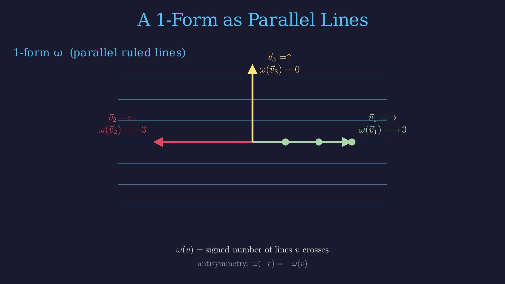

---

## Section 1: The Hodge Star Operator ★

> *中文:* "离散 Hodge 星算子，记作 ★，是连接原始复形 K 和对偶复形 K^* 的代数算子。"


Let K triangulate an orientable closed n-manifold with dual K^*. The **discrete Hodge star** is the linear map
\star_k : C^k(K) \to C^{n-k}(K^*)
sending each basis k-cochain (dual to \sigma \in K) to the basis (n-k)-cochain (dual to \sigma^* \in K^*).


For the Tonnetz torus (n = 2):

| Map | Dimensions | Musical translation |
|-----|------------|---------------------|
| \star_0 : C^0(K) \to C^2(K^*) | 12 \to 12 | Pitch-class weights → hexagonal face weights |
| \star_1 : C^1(K) \to C^1(K^*) | 36 \to 36 | Interval flows ↔ PLR voice-leading flows |
| \star_2 : C^2(K) \to C^0(K^*) | 24 \to 24 | Triad weights → dual vertex weights |

> *中文:* "★ 把 1-上链映射到 1-上链。边上的流映射到对偶边上的流。36 对 36，一维在二维流形上是自对偶的。"

**Worked examples**:

- **\star_0**: f \in C^0 with f(C)=1, all others $0$ → \star_0 f assigns $1$ to the hexagonal face of K^* surrounding C, bounded by the six triads containing C. Translates "note C" into "hexagonal region of triadic space centered on C."
- **\star_1 (self-dual)**: Flow +1 on edge [C,E] (major third) → the dual edge connects the two triads sharing C and E: C major and A minor. Translates "interval flow" into "PLR voice-leading motion between the two triads sharing that interval."


For an orientable closed n-manifold, the number of k-cells in K equals the number of (n-k)-cells in K^*. Consequently \star_k is a square matrix.



The construction of K^* gives a bijection \sigma \mapsto \sigma^* between k-simplices of K and (n-k)-cells of K^*. Therefore \dim C^k(K) = \dim C^{n-k}(K^*). \square


> *中文:* "Poincaré 对偶保证原始 k-胞腔数等于对偶 n-k 胞腔数，所以 ★ 总是方阵。"

**Self-duality at the middle dimension**: When k = n/2, \star_k maps a space to itself. For the Tonnetz torus (n=2, k=1): 1-cochains are self-dual. Same phenomenon: the electromagnetic field tensor F is a 2-form on Minkowski spacetime (n=4, k=2), and Maxwell's equations are dF = 0, d{\star}F = J.

> *中文:* "其实 Maxwell 方程组可以写成两行：dF = 0，d\star F = J。整个电磁学就是外微分 d 和 Hodge 星的组合。"

---

## Section 2: Inner Product and Adjoint Operators


Equip C^k with the inner product declaring all basis k-simplices orthonormal:
\langle e_i, e_j \rangle = \delta_{ij}


> *中文:* "我们给链空间 C_k 装一个标准内积，声明基底正交归一。"

The inner product identifies chains with cochains canonically, and gives us the **adjoint** of \partial — the key ingredient for the Hodge Laplacian.


The **coboundary** \delta_k := \partial_{k+1}^T : C^k \to C^{k+1} is the transpose of the boundary operator. It runs in the opposite direction:
C_2 \xrightarrow{\partial_2} C_1 \xrightarrow{\partial_1} C_0 \qquad \text{(boundary, downward)}
C^0 \xrightarrow{\delta_0 = \partial_1^T} C^1 \xrightarrow{\delta_1 = \partial_2^T} C^2 \qquad \text{(coboundary, upward)}
The adjoint property: \langle \partial_{k+1}\beta, \alpha \rangle = \langle \beta, \delta_k \alpha \rangle.


> *中文:* "伴随算子的方向和 \partial 相反。\partial 从高维到低维，它的转置从低维到高维。"

**Worked example (\delta_0 — discrete gradient)**: Let f \in C^0 have f(C) = 1, f = 0 elsewhere. Then (\delta_0 f)([C,E]) = f(E) - f(C) = -1 and (\delta_0 f)([G,C]) = f(C) - f(G) = +1. So \delta_0 f assigns -1 to every edge *leaving* C and +1 to every edge *arriving* at C — a discrete gradient converging toward the high-potential note.


\delta_k \circ \delta_{k-1} = 0.



\delta_k \circ \delta_{k-1} = \partial_{k+1}^T \circ \partial_k^T = (\partial_k \circ \partial_{k+1})^T = 0^T = 0. \square


---

## Section 3: The Hodge Laplacian

> *中文:* "L_k 的两个矩阵项分别检测两类'非调和'分量。\partial_k^T \partial_k 检测非零梯度，\partial_{k+1} \partial_{k+1}^T 检测非零旋度。"


The **k-th Hodge Laplacian** is the self-adjoint operator L_k : C^k \to C^k:
L_k = \partial_k^T \partial_k + \partial_{k+1} \partial_{k+1}^T

- \partial_k^T \partial_k (down-up): penalizes non-zero divergence (sources/sinks at vertices).
- \partial_{k+1} \partial_{k+1}^T (up-down): penalizes non-zero curl (circulation around faces).

L_1 \omega = 0 means the 1-cochain \omega has *neither* sources/sinks *nor* local whirlpools.


**Heat diffusion analogy**: Imagine edge flows as temperatures on a donut-shaped pipe network. L_1 \omega measures how far \omega is from thermal equilibrium. The equilibrium states — where no gradient wants to push heat downhill and no eddy stirs heat in circles — are the **harmonic forms**.


L_k is symmetric and positive semi-definite: \langle L_k \omega, \omega \rangle = \|\partial_k \omega\|^2 + \|\partial_{k+1}^T \omega\|^2 \geq 0.



\langle L_k \omega, \omega \rangle = \langle \partial_k^T \partial_k \omega, \omega \rangle + \langle \partial_{k+1} \partial_{k+1}^T \omega, \omega \rangle = \|\partial_k \omega\|^2 + \|\partial_{k+1}^T \omega\|^2 \geq 0. \square



For any finite simplicial complex K with the standard inner product:
\ker(L_k) \cong H^k(K;\mathbb{R}), \qquad \dim(\ker L_k) = \beta_k
Elements of \ker(L_k) are called **harmonic forms** (调和形式).



Since L_k is PSD:
\omega \in \ker(L_k) \iff \langle L_k \omega, \omega \rangle = 0 \iff \|\partial_k \omega\|^2 + \|\partial_{k+1}^T \omega\|^2 = 0
\iff \partial_k \omega = 0 \;\;\text{AND}\;\; \partial_{k+1}^T \omega = 0

So \ker(L_k) = \ker(\partial_k) \cap \ker(\partial_{k+1}^T) — the set of k-cycles that are orthogonal to all boundaries.

Since Z^k = B^k \oplus (Z^k \cap (B^k)^\perp) (orthogonal decomposition), we have H^k = Z^k/B^k \cong Z^k \cap (B^k)^\perp = \ker(L_k). Therefore \dim \ker(L_k) = \beta_k. \square


> *中文:* "Hodge 定理说，L_k 的 kernel 同构于第 k 个上同调群。kernel 里的元素叫调和形式。"

**Concrete numbers for the Tonnetz**:

| Laplacian | Size | \ker dimension | Musical interpretation |
|-----------|------|-----------------|------------------------|
| L_0 | 12\times 12 | \beta_0 = 1 | One constant harmonic function (connected) |
| L_1 | 36\times 36 | \beta_1 = 2 | Two independent harmonic interval flows |
| L_2 | 24\times 24 | \beta_2 = 1 | One harmonic 2-cochain (volume form) |

The two harmonic 1-cochains in \ker(L_1) correspond to:
1. The **circle of fifths direction**: C→G→D→A→E→B→F♯→C♯→A♭→E♭→B♭→F→C
2. The **major third direction**: C→E→G♯→C

These are the only non-zero flows on the torus that are simultaneously divergence-free and curl-free. A sphere (\beta_1 = 0) would have no such flows; a double torus (\beta_1 = 4) would have four.

> *中文:* "对 Tonnetz 上的 1-上链来说，调和空间的维度等于 \beta_1 = 2，对应五度圈方向和大三度方向的两个独立全局循环。"

---

## Section 4: The Hodge Decomposition Theorem

> *中文:* "任意 k 维上链都可以唯一正交分解为三个分量。"


For any finite simplicial complex K with standard inner product, the cochain space C^k admits an **orthogonal direct sum decomposition**:
C^k = \operatorname{im}(\partial_k^T) \;\oplus\; \operatorname{im}(\partial_{k+1}) \;\oplus\; \ker(L_k)

Every \omega \in C^k has a **unique** decomposition:
\omega = \underbrace{\omega_{\text{exact}}}_{\in\,\operatorname{im}(\partial_k^T)} \;+\; \underbrace{\omega_{\text{coexact}}}_{\in\,\operatorname{im}(\partial_{k+1})} \;+\; \underbrace{\omega_{\text{harmonic}}}_{\in\,\ker(L_k)}

Moreover: \|\omega\|^2 = \|\omega_\text{exact}\|^2 + \|\omega_\text{coexact}\|^2 + \|\omega_\text{harmonic}\|^2 (Pythagorean theorem for orthogonal components).



**Step 1: Pairwise orthogonality.**

**(a) \operatorname{im}(\partial_k^T) \perp \operatorname{im}(\partial_{k+1})**: For u = \partial_k^T \alpha and v = \partial_{k+1}\beta:
\langle u, v \rangle = \langle \partial_k^T \alpha, \partial_{k+1}\beta \rangle = \langle \alpha, \partial_k \partial_{k+1}\beta \rangle = \langle \alpha, 0 \rangle = 0 \;\checkmark

**(b) \operatorname{im}(\partial_k^T) \perp \ker(L_k)**: For u = \partial_k^T \alpha and \omega \in \ker(L_k) (which gives \partial_k \omega = 0):
\langle u, \omega \rangle = \langle \partial_k^T \alpha, \omega \rangle = \langle \alpha, \partial_k \omega \rangle = 0 \;\checkmark

**(c) \operatorname{im}(\partial_{k+1}) \perp \ker(L_k)**: For v = \partial_{k+1}\beta and \omega \in \ker(L_k) (which gives \partial_{k+1}^T \omega = 0):
\langle v, \omega \rangle = \langle \partial_{k+1}\beta, \omega \rangle = \langle \beta, \partial_{k+1}^T \omega \rangle = 0 \;\checkmark

**Step 2: The three subspaces span C^k.**

We show \dim(\operatorname{im}(\partial_k^T)) + \dim(\operatorname{im}(\partial_{k+1})) + \dim(\ker(L_k)) = \dim(C^k).

Since \partial_{k+1}^T \partial_k^T = (\partial_k \partial_{k+1})^T = 0, the cross-term in L_k vanishes when L_k acts on \operatorname{im}(\partial_k^T): for u = \partial_k^T \alpha, L_k u = \partial_k^T \partial_k \partial_k^T \alpha. One verifies L_k acts injectively (and thus surjectively) on each of \operatorname{im}(\partial_k^T) and \operatorname{im}(\partial_{k+1}) separately. Therefore \operatorname{im}(L_k) = \operatorname{im}(\partial_k^T) \oplus \operatorname{im}(\partial_{k+1}), and by rank-nullity:
\dim(\operatorname{im}(\partial_k^T)) + \dim(\operatorname{im}(\partial_{k+1})) + \dim(\ker(L_k)) = \dim(\operatorname{im}(L_k)) + \dim(\ker(L_k)) = \dim(C^k) \;\square


> *中文:* "这不是近似，是精确的数学定理。"

**Dimension count for k=1 on the Tonnetz**:

| Component | Subspace | Dimension |
|-----------|----------|-----------|
| Exact \omega_\text{exact} = \partial_1^T f | \operatorname{im}(\partial_1^T) | 11 = \operatorname{rank}(\partial_1) |
| Coexact \omega_\text{coexact} = \partial_2 g | \operatorname{im}(\partial_2) | 23 = \operatorname{rank}(\partial_2) |
| Harmonic | \ker(L_1) | 2 = \beta_1 |
| **Total** | C^1 | **36** ✓ |

**Meaning of each component**:

| Component | Formula | Vector calculus analogy | Characterization |
|-----------|---------|------------------------|-----------------|
| **Exact** | \partial_1^T f | Gradient \nabla f | Acyclic; flow on [u,v] is f(v)-f(u) |
| **Coexact** | \partial_2 g | Curl \nabla \times \mathbf{A} | Circulates locally around triangular faces |
| **Harmonic** | L_1 \omega = 0 | Harmonic function | Divergence-free AND curl-free simultaneously |

> *中文:* "Exact 分量——梯度。Coexact 分量——旋度。Harmonic 分量——沿着环面的拓扑洞做全局循环。"

**Water-on-a-donut analogy**:

| Type | Water analogy | Musical analogy |
|------|--------------|-----------------|
| **Exact** | Flows **downhill** from peak to valley | V→I cadence; directed tension-resolution |
| **Coexact** | **Whirlpools** spinning in tight circles | PLR cycles, chromatic voice leading |
| **Harmonic** | A **river circling the donut** — no hill drives it, no eddy spins it | Tonal center migrating along circle of fifths |

The decomposition is **orthogonal** — the three types never interfere.

**Computing the decomposition** (for implementation): The orthogonal projections use Moore–Penrose pseudoinverses:
\omega_\text{exact} = \partial_1^T(\partial_1 \partial_1^T)^\dagger \partial_1 \omega, \quad \omega_\text{coexact} = \partial_2(\partial_2^T \partial_2)^\dagger \partial_2^T \omega, \quad \omega_\text{harmonic} = \omega - \omega_\text{exact} - \omega_\text{coexact}

---

## Section 5: Three Musical Hypotheses

> *中文:* "Hodge 分解是定理。接下来我们提出三个可检验的音乐假设。"

**Encoding a chord progression**: Assign weights to Tonnetz edges traversed (e.g., proportional to interval activation duration). Apply the decomposition. The energy ratios E_\text{exact}/\|w\|^2, E_\text{coexact}/\|w\|^2, E_\text{harmonic}/\|w\|^2 give the harmonic profile.


A passage with high E_\text{exact}/\|w\|^2 tends to exhibit strong cadences and functional harmony.

**Reasoning**: \omega_\text{exact} = \partial_1^T f means flow on edge [u,v] equals f(v) - f(u): the progression flows from high-potential to low-potential pitch classes. Dominant (high potential) → tonic (low potential) is exactly this gradient structure. The exact component is automatically acyclic — consistent with goal-directed harmonic motion.

**Example**: Final bars of Bach chorale BWV 269. The cadence ii⁶–V–V⁷–I is almost pure gradient flow: f(D) > f(G) > f(C), monotonically descending to the tonic.

**Falsification**: Find high E_\text{exact} with no cadential structure.



A passage with high E_\text{coexact}/\|w\|^2 tends to exhibit PLR-type short cycles and chromatic voice leading.

**Reasoning**: \omega_\text{coexact} = \partial_2 g is a sum of triangle boundaries — local circulation around triads. Neo-Riemannian P, L, R transformations create short cycles wrapping around adjacent triangles (each step moves one voice by a semitone or whole tone).

**Example**: Opening of Brahms Intermezzo Op. 119 No. 1 — chains of third-related triads (B min → D maj → F♯ min → A maj → …), each a P or R step, locally circular with no global modulation. The hexatonic cycle (C maj → C min → A♭ maj → A♭ min → E maj → E min → C maj) lies entirely in \operatorname{im}(\partial_2).

**Falsification**: Find high E_\text{coexact} with no chromatic activity.



A passage with high E_\text{harmonic}/\|w\|^2 corresponds to modulation along the torus topology — the tonal center migrates globally.

**Reasoning**: \omega_\text{harmonic} \in \ker(L_1) means simultaneously divergence-free (\partial_1 \omega = 0) and curl-free (\partial_2^T \omega = 0). The only non-zero flows on a torus satisfying both are those along the two non-contractible loops: circle of fifths or major third axis. The tonal center itself migrates — no local potential drop or eddy explains it; the flow is topological.

**Examples**:
- Development of Schubert's String Quintet D. 956, mvt. 2: E maj → F min → chain of major-third related keys — traverses the major-third non-contractible loop.
- Development of Beethoven's "Waldstein" Sonata Op. 53: C → E → A♭ → C, a complete circle of major thirds — one generator of H_1.

**Falsification**: Find high E_\text{harmonic} with only nearby key relations.


**Caveats**:

> *中文:* "三个分量是结构性分解，不是价值判断。Exact 不等于'好'，harmonic 不等于'高级'。"

1. **No value judgment**: "Exact" does not mean better; "harmonic" does not mean more sophisticated.
2. **Model sensitivity**: Results depend on which Tonnetz variant is used, how durations are weighted, and how musical passages are segmented.
3. **Validation required**: Statistical testing on corpora (Bach chorales, common-practice sonatas, jazz standards) against baseline tonal-distance features is needed before these hypotheses can be accepted.

> *中文:* "验证需要在真实音乐语料库上做统计检验。"

---

## Section 6: Langlands Duality and the Tonnetz

> *中文:* "数学中的 Langlands 对偶，交换根与余根，恰好对应音乐中的大小调对偶。这是一个严格的结构性对应，不是松散类比。"

The standard Tonnetz triangulates the torus T^2 = \mathbb{R}^2 / \Lambda, where \Lambda is the **A_2 root lattice** — the lattice generated by the simple roots of the Lie algebra \mathfrak{sl}(3).


For a semisimple Lie algebra \mathfrak{g} with root system \Phi, the **coroot** of \alpha \in \Phi is \alpha^\vee = 2\alpha / \langle \alpha, \alpha \rangle. The **Langlands dual** \mathfrak{g}^\vee is obtained by \Phi \leftrightarrow \Phi^\vee.

For the A_2 root system (which is simply laced — all roots have the same length), roots and coroots differ only by uniform scaling, so A_2 is **self-dual**.



*(Rietsch, 2024)* On the A_2 Tonnetz, the Langlands involution — interchange of roots and coroots — structurally corresponds to major/minor duality: every major triad maps to its parallel minor.



*(Sketch — see Rietsch 2024 §3.)* The two simple root directions in the A_2 lattice correspond to the major third axis (+4 semitones) and the minor third axis (+3 semitones) of the Tonnetz. Swapping roots with coroots exchanges these two axes. In the Tonnetz, edge C \to E (major third, +4) maps to C \to E\flat (minor third, +3), and edge E \to G (minor third, +3) maps to E\flat \to G (major third, +4). The triangle \{C, E, G\} (C major) maps to \{C, E\flat, G\} (C minor). This involution acts globally on the entire A_2 lattice simultaneously, yielding the parallel-minor operation across all 24 triads. \square



**Euler 1739 → Rietsch 2024: A 285-year arc**

> *中文:* "Euler 在 1739 年画了一张音程网格。285 年后，我们才认出它里面藏着的代数拓扑结构。"

Euler drew his interval lattice as a tuning tool with no concept of simplicial homology, differential forms, or root systems. Yet the structure he wrote down is recognizable, 285 years later, as:

1. A simplicial triangulation of a torus with Betti numbers (1,2,1)
2. A space where the Hodge decomposition gives a tripartite analysis of harmony: gradients (cadences) + curls (PLR cycles) + topological flows (modulations)
3. A quotient of the A_2 root lattice — making its major/minor duality an instance of Langlands duality

The Hodge decomposition yields testable predictions: Bach chorales should have high E_\text{exact} (strong cadences); Brahms intermezzos high E_\text{coexact} (chromatic PLR); late Schubert high E_\text{harmonic} (third-relation modulations). Whether these energy ratios outperform simpler tonal-distance metrics is an open empirical question — but the mathematical structure is exact.

**Additional results** (Rietsch 2024): A Tonnetz on a *sphere* encoding all major ninth chords; the transformation group of the seventh-chord Tonnetz is S_5 \times \mathbb{Z}_{12}^4.

**Scope note**: The "Langlands duality" here operates at the level of root systems of A_2 — a very special case. It does not claim connections to the full Langlands program in number theory. The correspondence is precise but limited: a structural coincidence at the A_2 lattice level that turns out to have musical meaning.


---

## Historical Timeline

| Year | Development | Key figure(s) |
|------|-------------|---------------|
| 1739 | Euler's interval lattice (*Tentamen novae theoriae musicae*) | Leonhard Euler |
| 1941 | Hodge theory on Riemannian manifolds | W.V.D. Hodge |
| 1944 | Discrete Hodge theory on simplicial complexes | Beno Eckmann |
| 1998 | Chicken-wire torus from parsimonious voice leading | Douthett & Steinbach |
| 2011 | HodgeRank: Hodge decomposition for statistical ranking | Jiang, Lim, Yao & Ye |
| 2013 | Tonnetz as simplicial complex; computational homology | Bigo & Andreatta |
| 2020 | Hodge Laplacians on Graphs (key reference, free PDF) | Lek-Heng Lim |
| 2020 | Generalized Tonnetze topology and homology | Jason Yust |
| 2024 | Langlands duality = major/minor duality on A_2 Tonnetz | Konstanze Rietsch |

---

## Extended Reading











## Academic References

1. Euler, L. (1739). *Tentamen novae theoriae musicae*. St. Petersburg.
2. Hodge, W.V.D. (1941). *The Theory and Applications of Harmonic Integrals*. Cambridge University Press.
3. Eckmann, B. (1944). "Harmonische Funktionen und Randwertaufgaben in einem Komplex." *Commentarii Mathematici Helvetici* 17, 240–255.
4. Douthett, J. & Steinbach, P. (1998). "Parsimonious Graphs: A Study in Parsimony, Contextual Transformations, and Modes of Limited Transposition." *Journal of Music Theory* 42(2), 241–263.
5. Friedman, J. (1998). "Computing Betti Numbers via Combinatorial Laplacians." *Algorithmica* 21(4), 331–346.
6. Hatcher, A. (2002). *Algebraic Topology*. Cambridge University Press. Free PDF: https://pi.math.cornell.edu/~hatcher/AT/ATpage.html
7. Edelsbrunner, H. & Harer, J. (2010). *Computational Topology: An Introduction*. AMS.
8. Jiang, X., Lim, L.-H., Yao, Y. & Ye, Y. (2011). "Statistical Ranking and Combinatorial Hodge Theory." *Mathematical Programming* 127, 203–244.
9. Bigo, L. & Andreatta, M. (2013). "Computation and Visualization of Musical Structures in Chord-Based Simplicial Complexes." *MCM 2013*.
10. Frankel, T. (2012). *The Geometry of Physics*, 3rd ed. Cambridge University Press. Ch. 14.
11. Cannas, S. & Andreatta, M. (2018). "A Generalized Dual of the Tonnetz for Seventh Chords." *Bridges 2018*, 301–308.
12. Lim, L.-H. (2020). "Hodge Laplacians on Graphs." *SIAM Review* 62(3), 685–715. DOI: 10.1137/18M1223101. Free PDF: https://www.stat.uchicago.edu/~lekheng/work/hodge-graph.pdf — *Primary reference for all discrete Hodge theory in EP14.*
13. Yust, J. (2020). "Generalized Tonnetze and Zeitnetze, and the Topology of Music Concepts." *Journal of Mathematics and Music* 14(2), 170–203.
14. Humphreys, J. (1972). *Introduction to Lie Algebras and Representation Theory*. Springer GTM 9.
15. Rietsch, K. (2024). "Generalisations of Euler's Tonnetz on Triangulated Surfaces." *Journal of Mathematics and Music*. DOI: 10.1080/17459737.2024.2362132
